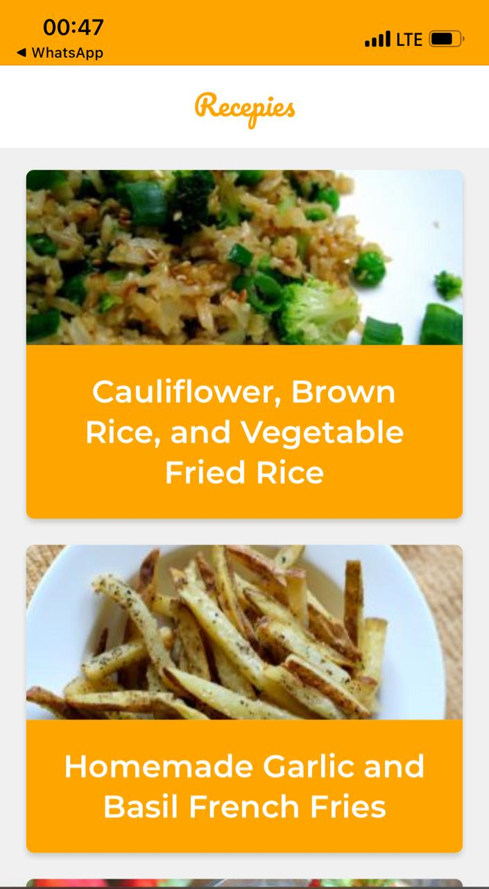

# Recipies

"Recipies" is a PWA that utilize the spoonacular recipes API to show some recipies with their respective ingredients and instructions, some features are:

* Offline support with Workbox.
* Network strategies for resources.
* Add to Home Screen posibility.
* Web Share API.

[Show App in production](https://build-two-pi.vercel.app/)

## Scripts

* `npm install` to install dependencies
* `npm run dev` to development enviroment
* `npm run build` to build a statics
* `npm run start` to product enviroment

## License

MIT

This project was bootstrapped with [Create React App](https://github.com/facebook/create-react-app).

